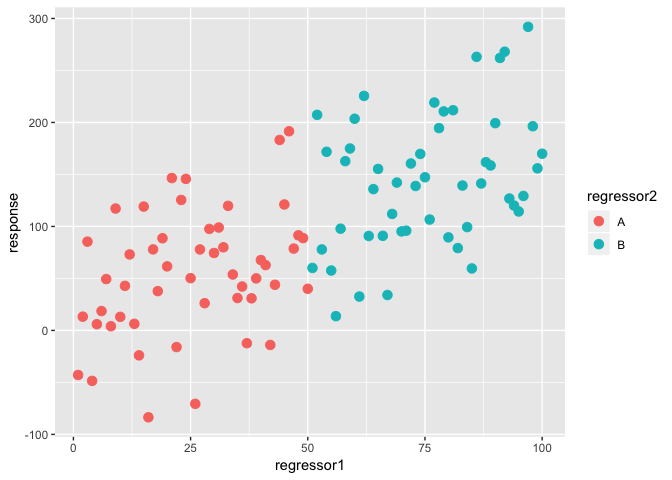

Linear model fitting examples
================

Example 4
---------

#### Generate data

``` r
set.seed(2)
regressor1<-c(1:100)
response<-2*regressor1+rnorm(100, 0,50)
regressor2<-c(rep("A", 50), rep("B", 50))
dat<-data.frame(response,regressor1,regressor2)
dat<-dat[sample(1:nrow(dat),nrow(dat), replace = F),]
head(dat)
```

    ##     response regressor1 regressor2
    ## 86 263.10613         86          B
    ## 64 135.90824         64          B
    ## 60 203.58094         60          B
    ## 95 114.36646         95          B
    ## 37 -12.29899         37          A
    ## 78 194.58949         78          B

Regressor 1 is continuous. Regressor 2 is categorical.

#### Visualize the data

``` r
library(ggplot2)
ggplot(data = dat, aes(x = regressor1, y = response, color = regressor2))+geom_point(size = 3)
```



#### The linear model

*y*<sub>*i*</sub> = *β*<sub>0</sub> + *β*<sub>1</sub>*x*<sub>*i*1</sub> + *β*<sub>2</sub>*x*<sub>*i*2</sub>
 or
\[*r**e**s**p**o**n**s**e*\]<sub>*i*</sub> = *β*<sub>0</sub> + *β*<sub>1</sub>\[*r**e**g**r**e**s**s**o**r*1\]<sub>*i*1</sub> + *β*<sub>2</sub>\[*B*\]<sub>*i*2</sub>
 where *B* = 0, 1

1.  Use two regressors

``` r
fit <- lm(response~1+regressor1+regressor2, data = dat)
summary(fit)
```

    ## 
    ## Call:
    ## lm(formula = response ~ 1 + regressor1 + regressor2, data = dat)
    ## 
    ## Residuals:
    ##     Min      1Q  Median      3Q     Max 
    ## -125.82  -39.24   -5.33   38.19  114.18 
    ## 
    ## Coefficients:
    ##             Estimate Std. Error t value Pr(>|t|)    
    ## (Intercept)   14.940     13.130   1.138 0.257971    
    ## regressor1     1.550      0.402   3.855 0.000208 ***
    ## regressor2B   12.532     23.208   0.540 0.590440    
    ## ---
    ## Signif. codes:  0 '***' 0.001 '**' 0.01 '*' 0.05 '.' 0.1 ' ' 1
    ## 
    ## Residual standard error: 58.01 on 97 degrees of freedom
    ## Multiple R-squared:  0.4362, Adjusted R-squared:  0.4246 
    ## F-statistic: 37.53 on 2 and 97 DF,  p-value: 8.479e-13

1.  Use just regressor 1

``` r
fit <- lm(response~1+regressor1, data = dat)
summary(fit)
```

    ## 
    ## Call:
    ## lm(formula = response ~ 1 + regressor1, data = dat)
    ## 
    ## Residuals:
    ##      Min       1Q   Median       3Q      Max 
    ## -127.477  -39.426   -6.457   37.639  111.700 
    ## 
    ## Coefficients:
    ##             Estimate Std. Error t value Pr(>|t|)    
    ## (Intercept)  11.7119    11.6474   1.006    0.317    
    ## regressor1    1.7377     0.2002   8.678 8.88e-14 ***
    ## ---
    ## Signif. codes:  0 '***' 0.001 '**' 0.01 '*' 0.05 '.' 0.1 ' ' 1
    ## 
    ## Residual standard error: 57.8 on 98 degrees of freedom
    ## Multiple R-squared:  0.4345, Adjusted R-squared:  0.4288 
    ## F-statistic: 75.31 on 1 and 98 DF,  p-value: 8.882e-14

1.  Use just regressor 2

``` r
fit <- lm(response~1+regressor2, data = dat)
summary(fit)
```

    ## 
    ## Call:
    ## lm(formula = response ~ 1 + regressor2, data = dat)
    ## 
    ## Residuals:
    ##      Min       1Q   Median       3Q      Max 
    ## -138.010  -45.471   -2.704   35.001  147.495 
    ## 
    ## Coefficients:
    ##             Estimate Std. Error t value Pr(>|t|)    
    ## (Intercept)   54.457      8.765   6.213 1.26e-08 ***
    ## regressor2B   90.016     12.396   7.262 9.18e-11 ***
    ## ---
    ## Signif. codes:  0 '***' 0.001 '**' 0.01 '*' 0.05 '.' 0.1 ' ' 1
    ## 
    ## Residual standard error: 61.98 on 98 degrees of freedom
    ## Multiple R-squared:  0.3499, Adjusted R-squared:  0.3432 
    ## F-statistic: 52.74 on 1 and 98 DF,  p-value: 9.182e-11

1.  Use just category A

``` r
fit <- lm(response~1+regressor1, data = dat[dat$regressor2=="A",])
summary(fit)
```

    ## 
    ## Call:
    ## lm(formula = response ~ 1 + regressor1, data = dat[dat$regressor2 == 
    ##     "A", ])
    ## 
    ## Residuals:
    ##      Min       1Q   Median       3Q      Max 
    ## -125.775  -31.405   -6.232   37.627  107.056 
    ## 
    ## Coefficients:
    ##             Estimate Std. Error t value Pr(>|t|)  
    ## (Intercept)  17.0981    16.2300   1.053    0.297  
    ## regressor1    1.4651     0.5539   2.645    0.011 *
    ## ---
    ## Signif. codes:  0 '***' 0.001 '**' 0.01 '*' 0.05 '.' 0.1 ' ' 1
    ## 
    ## Residual standard error: 56.52 on 48 degrees of freedom
    ## Multiple R-squared:  0.1272, Adjusted R-squared:  0.109 
    ## F-statistic: 6.995 on 1 and 48 DF,  p-value: 0.01101

1.  Use just category B

``` r
fit <- lm(response~1+regressor1, data = dat[dat$regressor2=="B",])
summary(fit)
```

    ## 
    ## Call:
    ## lm(formula = response ~ 1 + regressor1, data = dat[dat$regressor2 == 
    ##     "B", ])
    ## 
    ## Residuals:
    ##     Min      1Q  Median      3Q     Max 
    ## -100.39  -43.56  -11.23   46.70  112.36 
    ## 
    ## Coefficients:
    ##             Estimate Std. Error t value Pr(>|t|)   
    ## (Intercept)  21.0820    45.2141   0.466  0.64313   
    ## regressor1    1.6343     0.5882   2.778  0.00777 **
    ## ---
    ## Signif. codes:  0 '***' 0.001 '**' 0.01 '*' 0.05 '.' 0.1 ' ' 1
    ## 
    ## Residual standard error: 60.02 on 48 degrees of freedom
    ## Multiple R-squared:  0.1385, Adjusted R-squared:  0.1206 
    ## F-statistic:  7.72 on 1 and 48 DF,  p-value: 0.007772
